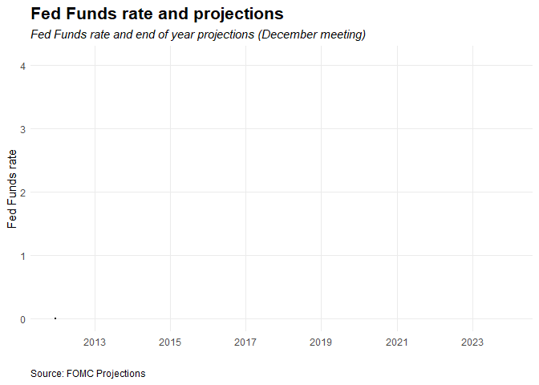
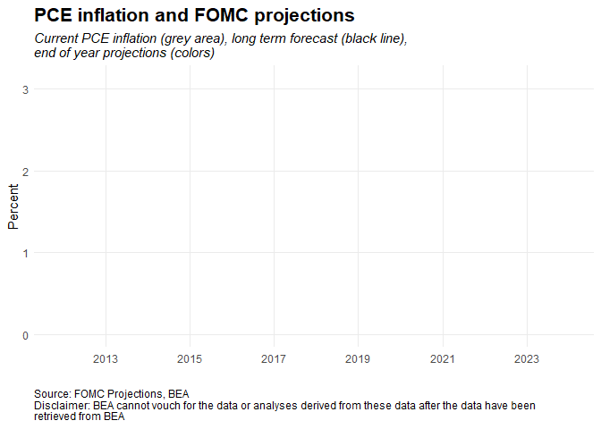
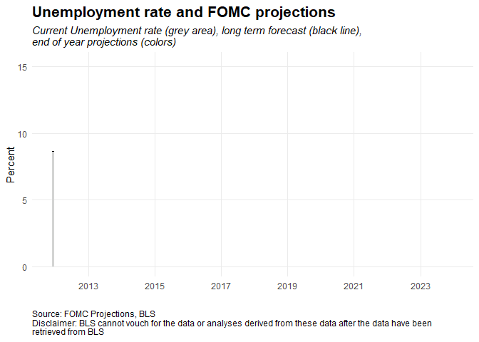
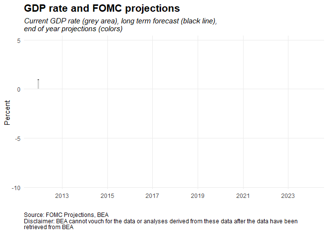

```{r setup, include=FALSE}
knitr::opts_chunk$set(echo = TRUE)

#####################################################################################################
### Libraries                                                                                     ###
#####################################################################################################


library(tidyverse)
library(rvest)
library(stringr)
library(gganimate)
library(gifski)
library(lubridate)

#####################################################################################################
### Sourcing parsing scripts                                                                      ###
#####################################################################################################

#source('getData.r')

###source scraping
#source('parseProjections.R')


#####################################################################################################
### Importing .csv files with parsed projection tables                                            ###
#####################################################################################################


proj_table <- read.table(
  "data//projections_table.csv",  
  sep=",", header=TRUE)

dataTable <- read.table(
  "data//dataTable.csv",  
  sep=",", header=TRUE)

#####################################################################################################
### Some additional cleaning and wrangling                                                        ###
#####################################################################################################

#Remove spaces in "des" so all looks the same
proj_table$des <- gsub('\\s+', '', proj_table$des)


##Get longer run, and put as an column to link it to meetingdates
longer_run <- proj_table %>%
  filter(forecast_period %in% c("Longer run", "Longer Run"))%>%
  mutate(date = as.Date(gsub("\\D", "", date), format = "%Y%m%d"))%>%
  rename(longer_run = values)#%>%
#  filter(des %in% c("Median 1", "Median1"))%>%
 # select(variable, longer_run, date)


proj_table <- proj_table %>%
  mutate(projection = date)%>%
  filter(!forecast_period %in% c("Longer run", "Longer Run"))%>%
    mutate(date = as.Date(gsub("\\D", "", date), format = "%Y%m%d"))%>%
  mutate(forecast_period = as.Date(paste(forecast_period, 12, 31, sep = "-")))%>%
# mutate(values = as.numeric(as.character(values)))%>% ##as they are factors you need as.characters before as.numeric
  mutate(meeting_month = months(date))%>%
  mutate(projection_year = substr(projection, 1, 4))#%>%
#  filter(des %in% c("Median 1", "Median1"))


proj_table$forecast_period <- as.Date(proj_table$forecast_period, format = "%Y-%m-%d")
proj_table$date <- as.Date(proj_table$date, format = "%Y-%m-%d")


#####################################################################################################
#####################################################################################################
###
### Data wrangling and plot function  
###
#####################################################################################################
#####################################################################################################


plotFunction <- function(variable_name, LineDescription_name, start_date, title_text, subtitle_text, caption_text) {

  
temp <- proj_table %>%
  filter(variable %in% variable_name)%>%
  filter(meeting_month %in% c("december"))%>%
  filter(des %in% c("Median1"))%>%
  mutate(values = as.numeric(as.character(values))) ##as they are factors you need as.characters before as.numeric


####Always include the last if it is the current year
last_projection <- proj_table %>%
  filter(date == max(date))%>%
  filter(year(date) == year(Sys.Date()))%>%
  filter(variable %in% variable_name)

#Merge
temp <- rbind(temp, last_projection) %>%
  select(-date)


##Merge historical data
df <- dataTable %>%
  filter(LineDescription == LineDescription_name)

##convert temp dates to dates:D
df <- df %>%
  mutate(date = as.Date(as.character(date)))

temp <- merge(df, temp, by.x = "date", by.y ="forecast_period", all = TRUE)

#change na projections to ""
temp$projection_year[is.na(temp$projection_year)] <- ""


#####################################################################################################
### Merge with longer run Projection                                                              ###
#####################################################################################################


temp_longer_run <- longer_run %>%
  filter(variable %in% variable_name)%>%
  filter(des %in% c("Median 1", "Median1"))%>%
  select(-c("variable", "des"))


temp <- merge(temp, temp_longer_run, by=c("date"), all.x = TRUE)

temp <- arrange(temp, date)


temp <- temp %>%
  fill(longer_run, .direction = "down")

#temp$longer_run[is.na(temp$longer_run)] <- ""
temp$longer_run <- as.numeric(as.character(temp$longer_run))


####Calculate max and min for the plot
max_y <- max(
  max(temp$rate, na.rm = TRUE),
  max(temp$values, na.rm = TRUE),
  max(temp$longer_run, na.rm = TRUE)
) + 0.5

min_y <- min(
  min(temp$rate, na.rm = TRUE),
  min(temp$values, na.rm = TRUE),
  min(temp$longer_run, na.rm = TRUE)
) 

if (min_y < 0) {
  min_y =min_y - 0.5
}
if (min_y >= 0) {
  min_y = 0
}


##to be able to change start date
temp <- temp %>% 
  filter(date > start_date)


#plotting
p <- ggplot(temp, aes(x = date, y = rate)) + 
  geom_line(size = 1)+
  geom_area(fill = "lightgrey")+
  geom_line(aes(y=longer_run), linetype="dashed", size=1)+
  geom_line(aes(y=values, group = projection_year, color = projection_year), linetype="dashed", size=1)+
  #  geom_line(aes(y=values, group = projection_year), linetype="dashed", size=1)+
  theme_minimal() +
  
  theme(legend.position="none",
        legend.title = element_blank(),
        plot.caption=element_text(hjust=0),
        plot.subtitle=element_text(face="italic"),
        plot.title=element_text(size=16,face="bold"))+
  
  labs(x="",y="Percent",
       title=title_text,
       subtitle=subtitle_text,
       caption=caption_text
  )+
  
  scale_x_date(date_breaks = "2 year",
               date_labels = "%Y")+
  theme(
    panel.grid.minor = element_blank()
  )+ 
  ylim(min_y, max_y)


}

```


---

Economic projections are collected from each member of the Board of Governors and each Federal Reserve Bank president four times a year. This report extracts and plots the projections. Please see *[github](https://github.com/cnordenlow/fomc-projections)* for methodology.


**Table of Contents**

* [Fed Funds rate and FOMC projections](#fed-funds-rate-and-fomc-projections) 

* [PCE inflation and FOMC projections](#pce-inflation-and-fomc-projections) 

* [Unemployment rate and FOMC projections](#unemployment-rate-and-fomc-projections) 

* [GDP and FOMC projections](#gdp-rate-and-fomc-projections) 


#### Fed Funds rate and FOMC projections
```{r, echo=FALSE, messages=FALSE, warning =FALSE, results=FALSE}

#variable_name = c("Federal funds rate")

variable_name = c("Federal funds rate") ##FOMC names
LineDescription_name = "Federal funds rate" ##US data names
start_date = "2010-12-30"

title_text ="Fed Funds rate and FOMC projections"
subtitle_text ="Current Fed Funds rate (grey area), long term forecast (black line),\nend of year projections (colors)"
caption_text ="Source: FOMC Projections"
  

p <- plotFunction(variable_name,LineDescription_name, start_date,title_text, subtitle_text,caption_text)

#p

p <- p +
  transition_reveal(date)


anim_save("animatedFedFundsProjections.gif",animate(p, duration = 12, renderer=gifski_renderer(loop = FALSE)))


```




#### PCE inflation and FOMC projections
```{r, echo=FALSE, messages=FALSE, warning =FALSE, results=FALSE}


variable_name = c("PCE inflation") ##FOMC names
LineDescription_name = "Personal consumption expenditures (PCE)" ##US data names
start_date = "2010-12-30"

title_text ="PCE inflation and FOMC projections"
subtitle_text ="Current PCE inflation (grey area), long term forecast (black line), \nend of year projections (colors)"
caption_text ="Source: FOMC Projections, BEA \nDisclaimer: BEA cannot vouch for the data or analyses derived from these data after the data have been \nretrieved from BEA"
  
  

p <- plotFunction(variable_name,LineDescription_name, start_date,title_text, subtitle_text,caption_text)

#p

p <- p +
  transition_reveal(date)


anim_save("animatedPCE.gif",animate(p, duration = 12, renderer=gifski_renderer(loop = FALSE)))


```




#### Unemployment rate and FOMC projections
```{r, echo=FALSE, messages=FALSE, warning =FALSE, results=FALSE}


variable_name = c("Unemployment rate") ##FOMC names
LineDescription_name = "Unemployment rate" ##US data names
start_date = "2010-12-30"

title_text ="Unemployment rate and FOMC projections"
subtitle_text ="Current Unemployment rate (grey area), long term forecast (black line), \nend of year projections (colors)"
caption_text ="Source: FOMC Projections, BLS \nDisclaimer: BLS cannot vouch for the data or analyses derived from these data after the data have been \nretrieved from BLS"
  
  

p <- plotFunction(variable_name,LineDescription_name, start_date,title_text, subtitle_text,caption_text)

#p

p <- p +
  transition_reveal(date)


anim_save("animatedUnemployment.gif",animate(p, duration = 12, renderer=gifski_renderer(loop = FALSE)))


```




#### GDP rate and FOMC projections
```{r, echo=FALSE, messages=FALSE, warning =FALSE, results=FALSE}


variable_name = c("Change in real GDP") ##FOMC names
LineDescription_name = "Gross domestic product (GDP)" ##US data names
start_date = "2010-12-30"

title_text ="GDP rate and FOMC projections"
subtitle_text ="Current GDP rate (grey area), long term forecast (black line), \nend of year projections (colors)"
caption_text ="Source: FOMC Projections, BEA \nDisclaimer: BEA cannot vouch for the data or analyses derived from these data after the data have been \nretrieved from BEA"
  

p <- plotFunction(variable_name,LineDescription_name, start_date,title_text, subtitle_text,caption_text)

#p

p <- p +
  transition_reveal(date)


anim_save("animatedGDP.gif",animate(p, duration = 12, renderer=gifski_renderer(loop = FALSE)))


```



